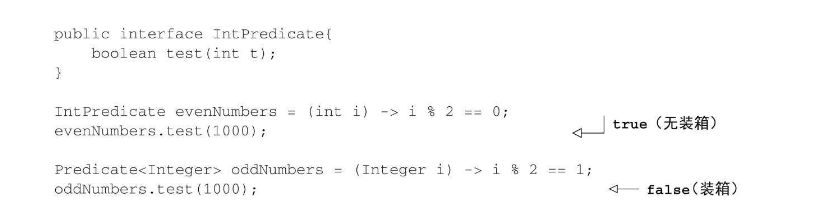

##章节主要问题
### Q1 Lambda管中窥豹
### Q2 在哪里以及如何用Lambda
### Q3 环绕执行模式
### Q4 函数式接口，类型推断
### Q5 方法引用
### Q5 Lambda复合

#### Lambda管中窥豹
lambda可以理解为简洁的表示可传递的匿名函数：没有名字，有参数列表、函数主体、返回值类型
lambda基本语法：
```java
    (parameters) -> expression
    (parameters) -> { statement; }
```

#### lambda使用场景

1. 函数式接口（所谓函数式接口，即只定义一个抽象方法的接口） **接口可以有默认方法，但是哪怕有很多默认方法，只要这个接口只定义了一个抽象方法，那它就是一个函数式接口**
   lambda表达式允许以内联的形式直接为函数式接口的抽象方法提供实现，并把整个表达式作为函数式接口的实例（即它是函数式接口的一个实例）
2. 函数描述符
    函数式接口的抽象方法的签名基本上就是lambda表达式的签名。将这种抽象方法叫函数描述符。比如，Runnable接口可以看作一个什么也不接受什么也不返回的函数的签名，因为它只有一个run方法，且该方法什么也不接受，什么也不返回。
    
    lambda表达式可以被赋值给一个变量，也可以传递给一个接受函数式接口做参数的方法。
   **新的Java API中，函数式接口都带有@FunctionalInterface标注。这个标注表示将该接口设计成函数式接口，如果用了这个标注但是它却不是函数式接口，编译时会报错。这个标注不是必须的，但它是一个好做法。**

#### 环绕执行模式
1. 将行为参数化
2. 使用函数式接口传递行为
3. 执行一个行为
4. 传递lambda

#### 使用函数式接口
1. Predicate
    java.util.function.Predicate<T>接口定义了一个名字叫test的抽象方法，接受泛型T对象，并返回一个boolean。
2. Consumer 
    java.util.function.Consumer<T>接口定义了一个名字叫accept的抽象方法，接受泛型T对象，没有返回(void)。如果要访问类型T的对象，并不需要返回值，就可以用这个接口。
3. Function
   java.util.function.Function<T,R>接口定义了名叫apply的抽象方法，接受泛型T的对象，并返回泛型R的对象。
4. 原始类型特化
    java8为函数式接口带来一个专门的版本，以便在输入输出都是原始类型时避免自动装箱操作。（自动装箱带来性能损耗）示例如下：
    
    一般的，针对专门的输入参数类型的函数式接口的名称都要加上对应的原始类型前缀，如DoublePredicate、IntConsumer、LongBinaryOperator、IntFunction等。Function接口还有针对输出参数类型的变种：ToIntFunction<T>、IntToDoubleFunction等。

#### 类型检查、类型推断以及限制
lambda表达式本身并不包含它在实现哪个函数式接口的信息。所以，lambda的实际类型是什么？
1. 类型检查
    lambda的类型是从使用lambda的上下文推断出来的。通过下图解读lambda表达式的类型检查过程
    
2. 同样的lambda，不同的函数式接口
   同一个Lambda表达式可以与不同的函数式接口联系起来，只要它们的抽象方法签名能够兼容。比如，Callable和PrivilegedAction，这两个接口都代表着什么也不接受且返回一个泛型T的函数。因此，如下的复制都是有效的:
```java
import java.security.PrivilegedAction;
import java.util.concurrent.Callable;

public class MainTest {
    Callable<Integer> c = () -> 42;
    PrivilegedAction p = () -> 42;
}
```
**特殊的void兼容原则：如果一个lambda的主体是一个语句表达式，它就和一个返回void的函数描述符兼容（当然参数列表也需要兼容）。**
3. 类型推断
   Java编译器会从上下文（目标类型）推断出用什么函数式接口来配合Lambda表达式，这意味着它也可以推断出适合Lambda的签名，因为函数描述符可以通过目标类型来得到。这样做的好处在于，编译器可以了解Lambda表达式的参数类型，这样就可以在Lambda语法中省去标注参数类型。如下示例：
```java
import java.util.ArrayList;
import java.util.List;
import java.util.function.Predicate;

public class MainTest {
    public <T> List<T> filter(List<T> list, Predicate<T> p) {
        List<T> newArrayList = new ArrayList<>();
        for (T t:
             list) {
            if(p.test(t)) {
                newArrayList.add(t);
            }
        }
        return newArrayList;
    }

    public void test() {
        List<Integer> testList = new ArrayList<>();
        for(int i=1; i< 10; i++) {
            testList.add(i);
        }
        List<Integer> newList = filter(testList, a -> a > 6);
    }

}
```
Lambda表达式有多个参数，代码可读性的好处就更为明显。例如，你可以这样来创建一个Comparator对象：
```java
// 无类型推断
Comparator<Integer> c = (Integer a1, Integer a2) -> a1.compareTo(a2);
// 有类型推断
Comparator<Integer> c2 = (a1, a2) -> a1.compareTo(a2);
```
请注意，有时候显式写出类型更易读，有时候去掉它们更易读。没有什么法则说哪种更好；对于如何让代码更易读，我们必须做出自己的选择。
4. 使用局部变量
   Lambda表达式也允许使用自由变量（不是参数，而是在外层作用域中定义的变量），就像匿名类一样。它们被称作捕获Lambda。
```java
public void useLocalVar() {
    int portNumber = 13337;
    Runnable r = () -> System.out.println(portNumber);
}
```
关于能对这些变量做什么有限制
Lambda可以没有限制地捕获（也就是在其主体中引用）实例变量和静态变量。但局部变量必须显式声明为final，或事实上是final。换句话说，Lambda表达式只能捕获指派给它们的局部变量一次。（注：捕获实例变量可以被看作捕获最终局部变量this。）
如下面的示例代码无法通过编译，因为portNumber被赋值了两次
```java
public void useLocalVar() {
    // lambda 表达式中使用的变量应为 final 或有效 final
    int portNumber = 13337;
    Runnable r = () -> System.out.println(portNumber);
    portNumber = 13338;
}
```

#### 方法引用


    

