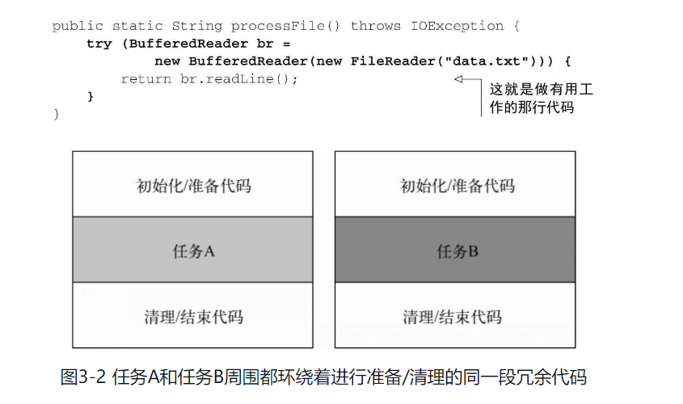
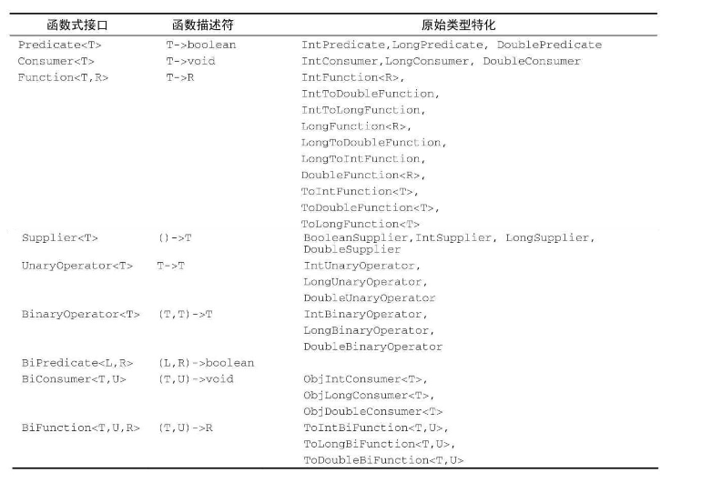

##章节主要问题
### Q1 Lambda管中窥豹
### Q2 在哪里以及如何用Lambda
### Q3 环绕执行模式
### Q4 函数式接口，类型推断
### Q5 方法引用
### Q5 Lambda复合

#### Lambda管中窥豹
lambda可以理解为简洁的表示可传递的匿名函数：没有名字，有参数列表、函数主体、返回值类型
lambda基本语法：
```java
    (parameters) -> expression
    (parameters) -> { statement; }
```

#### lambda使用场景

1. 函数式接口（所谓函数式接口，即只定义一个抽象方法的接口） **接口可以有默认方法，但是哪怕有很多默认方法，只要这个接口只定义了一个抽象方法，那它就是一个函数式接口**
   lambda表达式允许以内联的形式直接为函数式接口的抽象方法提供实现，并把整个表达式作为函数式接口的实例（即它是函数式接口的一个实例）
2. 函数描述符
    函数式接口的抽象方法的签名基本上就是lambda表达式的签名。将这种抽象方法叫函数描述符。比如，Runnable接口可以看作一个什么也不接受什么也不返回的函数的签名，因为它只有一个run方法，且该方法什么也不接受，什么也不返回。
    
    lambda表达式可以被赋值给一个变量，也可以传递给一个接受函数式接口做参数的方法。
   **新的Java API中，函数式接口都带有@FunctionalInterface标注。这个标注表示将该接口设计成函数式接口，如果用了这个标注但是它却不是函数式接口，编译时会报错。这个标注不是必须的，但它是一个好做法。**

#### 环绕执行模式
1. 将行为参数化
2. 使用函数式接口传递行为
3. 执行一个行为
4. 传递lambda

#### 使用函数式接口
1. Predicate
    java.util.function.Predicate<T>接口定义了一个名字叫test的抽象方法，接受泛型T对象，并返回一个boolean。
2. Consumer 
    java.util.function.Consumer<T>接口定义了一个名字叫accept的抽象方法，接受泛型T对象，没有返回(void)。如果要访问类型T的对象，并不需要返回值，就可以用这个接口。
3. Function
   java.util.function.Function<T,R>接口定义了名叫apply的抽象方法，接受泛型T的对象，并返回泛型R的对象。
4. 

